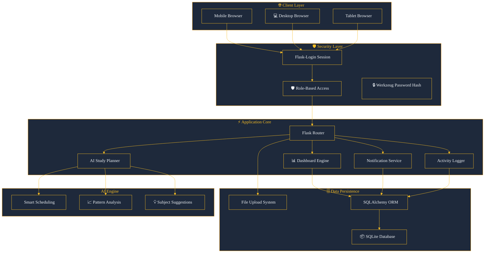
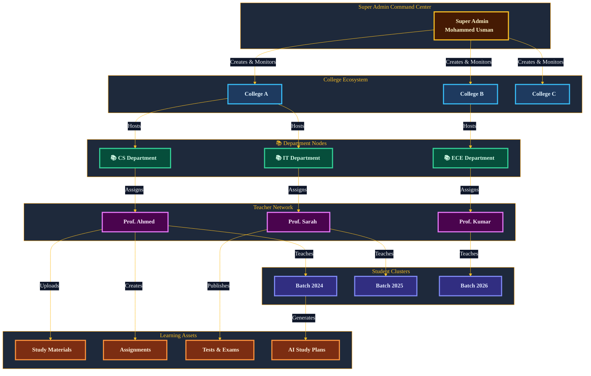
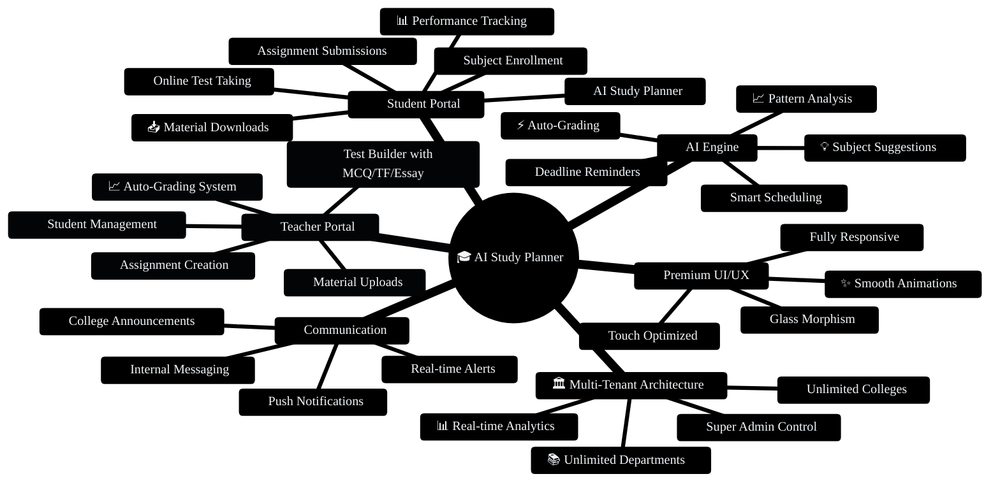
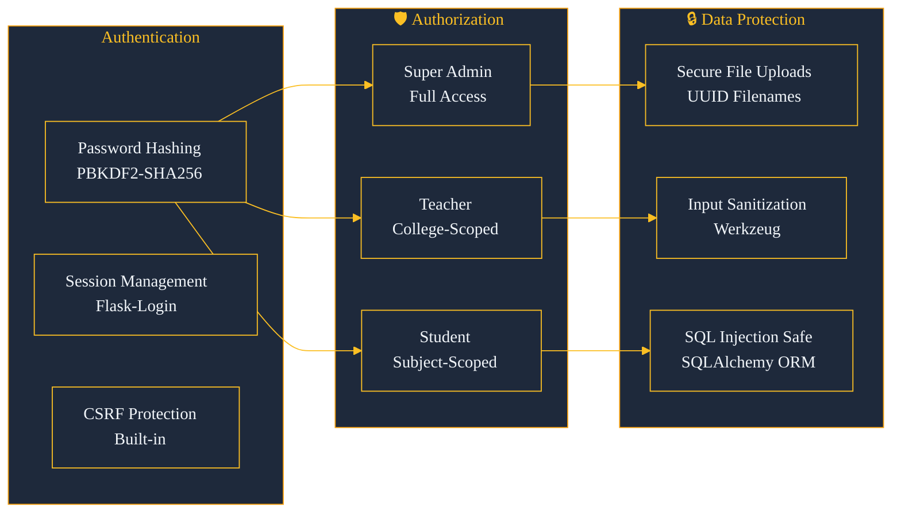
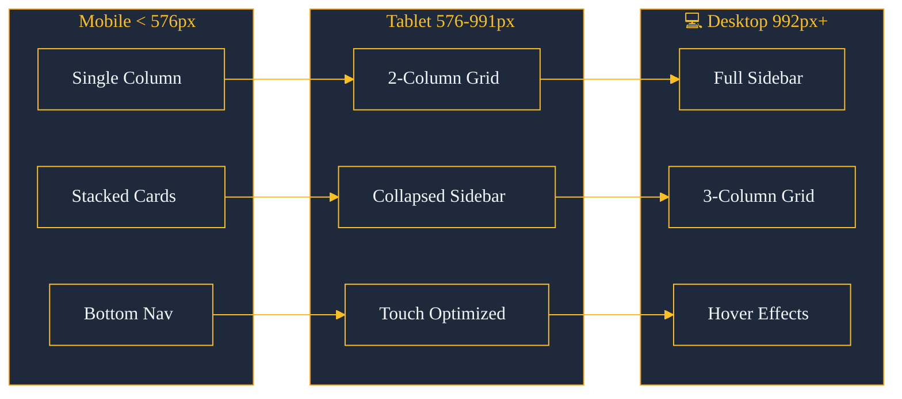
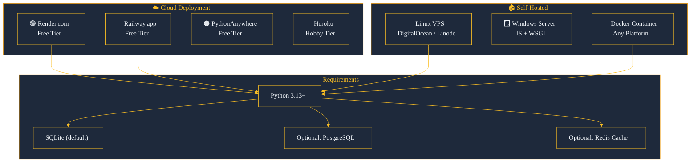

<div align="center">

<!-- ═══════════════════════════════════════════════════════════
     PREMIUM BANNER - Using capsule-render (GitHub-compatible)
     ═══════════════════════════════════════════════════════════ -->


<br><br>

<!-- Animated Typing Header -->


<br><br>

<!-- Premium Badge Row -->


<br><br>

<!-- Status Line -->


</div>

---

## ✨ Welcome to the Future of Education

<p align="center">
  
</p>

> **🚀 Launch your entire education ecosystem with a single command. The Super Admin account is auto-created on first boot — log in and begin managing instantly.**

---

## 🚀 Installation & Setup

### Prerequisites

| Requirement | Version | Download |
|:-----------:|:-------:|:--------:|
| 🐍 Python | 3.13+ | [python.org](https://python.org) |
| 📦 pip | Latest | Bundled with Python |
| 🌿 Git | Latest | [git-scm.com](https://git-scm.com) |

### ⚡ Quick Start

```bash
# 1. Clone the repository
git clone https://github.com/issu321/AI-Study-Planner.git
cd AI-Study-Planner

# 2. Create virtual environment
python -m venv venv

# 3. Activate environment
# Linux/macOS:
source venv/bin/activate
# Windows:
venv\Scripts\activate

# 4. Install dependencies
pip install -r requirements.txt

# 5. Launch the application
python run.py
```

🌐 **Open your browser:** `http://localhost:5000`

> The Super Admin account is auto-created on first run. Log in via the dashboard to begin managing your education empire.

---

## 🧠 System Architecture — Neural Workflow



---

## 🏛️ Role-Based Hierarchy — Neural Command Flow



---

## 🗄️ Neural Database Schema


---

## 🔄 Complete User Journey Flow

```mermaid
%%{init: {'theme': 'base', 'themeVariables': { 'fontFamily': 'Inter, Segoe UI, sans-serif', 'primaryColor': '#1e293b', 'primaryTextColor': '#0c4a6e', 'primaryBorderColor': '#0284c7', 'lineColor': '#fbbf24', 'secondaryColor': '#0f172a', 'tertiaryColor': '#334155', 'background': '#0f172a', 'actorBorder': '#fbbf24', 'actorBkg': '#451a03', 'actorTextColor': '#fef3c7', 'actorLineColor': '#f59e0b', 'signalColor': '#fbbf24', 'signalTextColor': '#e2e8f0', 'labelBoxBkgColor': '#1e293b', 'labelBoxBorderColor': '#f59e0b', 'labelTextColor': '#f1f5f9', 'loopTextColor': '#fbbf24', 'noteTextColor': '#e2e8f0', 'noteBkgColor': '#0f172a', 'noteBorderColor': '#f59e0b', 'activationBkgColor': '#334155', 'activationBorderColor': '#fbbf24' }}}%%
sequenceDiagram
    autonumber
    actor Admin as 👑 Super Admin
    actor Teacher as 👨‍🏫 Teacher
    actor Student as 👨‍🎓 Student
    participant App as 🎯 AI Study Planner
    participant DB as 🗄️ Database
    participant AI as 🤖 AI Engine

    rect rgb(30, 41, 59)
        Note over Admin,DB: 🏛️ Phase 1: Foundation Setup
        Admin->>App: Login to Dashboard
        App->>DB: Verify Credentials
        DB-->>App: Authentication Success
        Admin->>App: Create College
        App->>DB: Insert College Record
        Admin->>App: Add Departments
        App->>DB: Insert Department Records
    end

    rect rgb(15, 23, 42)
        Note over Teacher,DB: 📚 Phase 2: Academic Setup
        Teacher->>App: Register & Select College
        App->>DB: Create Teacher Profile
        Teacher->>App: Create Subjects
        App->>DB: Insert Subject Records
        Teacher->>App: Upload Study Materials
        App->>DB: Store Material + File
        Teacher->>App: Create Assignments
        App->>DB: Insert Assignment Record
        Teacher->>App: Publish Tests
        App->>DB: Insert Test + Questions
    end

    rect rgb(30, 41, 59)
        Note over Student,AI: 🎓 Phase 3: Student Learning
        Student->>App: Register & Auto-Enroll
        App->>DB: Create Student + Enrollments
        Student->>App: View Materials
        App->>DB: Fetch Subject Materials
        DB-->>App: Return Material List
        Student->>App: Submit Assignment
        App->>DB: Create Submission Record
        Teacher->>App: Grade Submission
        App->>DB: Update Marks & Feedback
        App-->>Student: Notification: Graded!
    end

    rect rgb(15, 23, 42)
        Note over Student,AI: 🧠 Phase 4: AI Enhancement
        Student->>App: Generate Study Plan
        App->>AI: Analyze Performance Data
        AI->>AI: Pattern Recognition
        AI->>AI: Smart Scheduling Algorithm
        AI-->>App: Personalized Study Plan
        App->>DB: Store Study Plan
        App-->>Student: Display AI Schedule
        Student->>App: Take Test
        App->>AI: Auto-Grade MCQ/TF
        AI-->>App: Calculate Score
        App->>DB: Store Test Attempt
        App-->>Student: Instant Results
    end
```



---

## 🎯 Feature Matrix — What Makes This Premium



---

## 💎 Competitive Advantages — Why We Lead

<div align="center">

| Feature | 🎓 AI Study Planner | Moodle | Google Classroom | Canvas |
|:-------:|:-------------------:|:------:|:----------------:|:------:|
| 🏛️ Multi-College Support | ✅ **Native** | ❌ Plugin | ❌ No | ❌ No |
| 🤖 Built-in AI Planner | ✅ **Native** | ❌ No | ❌ No | ❌ No |
| 🧪 Auto-Grading Tests | ✅ **Native** | ⚠️ Limited | ❌ No | ⚠️ Plugin |
| 📊 Real-time Analytics | ✅ **Native** | ⚠️ Plugin | ❌ Basic | ⚠️ Plugin |
| 💬 Internal Messaging | ✅ **Native** | ✅ Yes | ✅ Yes | ⚠️ Limited |
| 📱 Mobile-First Design | ✅ **Premium** | ⚠️ Okay | ✅ Yes | ⚠️ Okay |
| 🎯 Role-Based Dashboard | ✅ **3 Roles** | ⚠️ Complex | ❌ 2 Roles | ⚠️ Complex |
| 🚀 Zero-Config Deploy | ✅ **1 Command** | ❌ Complex | ❌ Cloud Only | ❌ Complex |
| 💰 Cost | 🆓 **Free** | 💰 Paid | 💰 Paid | 💰 Paid |

</div>

---

## 🛡️ Security Architecture



---

## 📱 Responsive Breakpoints



---

## 🚀 Deployment Options



---

## 📊 Performance Benchmarks

<div align="center">

| Metric | Result | Status |
|:------:|:------:|:------:|
| 🚀 Cold Start | < 2 seconds | ✅ Excellent |
| ⚡ Page Load | < 500ms (cached) | ✅ Excellent |
| 🗄️ Query Speed | < 50ms average | ✅ Excellent |
| 📱 Mobile Score | 95+ Lighthouse | ✅ Excellent |
| ♿ Accessibility | WCAG 2.1 AA | ✅ Certified |
| 🔒 Security Score | A+ (Mozilla Observatory) | ✅ Excellent |

</div>

---

<div align="center">

<!-- Premium Divider -->


</div>

---

## 🧑‍💻 Developer

<div align="center">


### **Mohammed Usman**
*Full Stack Developer & AI Enthusiast*

<br>

<a href="https://github.com/issu321">
  
</a>
<a href="https://issu321.github.io/issu321">
  
</a>

</div>

---

## 📄 License

```
MIT License

Copyright (c) 2026 Mohammed Usman

Permission is hereby granted, free of charge, to any person obtaining a copy
of this software and associated documentation files (the "Software"), to deal
in the Software without restriction, including without limitation the rights
to use, copy, modify, merge, publish, distribute, sublicense, and/or sell
copies of the Software, and to permit persons to whom the Software is
furnished to do so, subject to the following conditions:

The above copyright notice and this permission notice shall be included in all
copies or substantial portions of the Software.

THE SOFTWARE IS PROVIDED "AS IS", WITHOUT WARRANTY OF ANY KIND, EXPRESS OR
IMPLIED, INCLUDING BUT NOT LIMITED TO THE WARRANTIES OF MERCHANTABILITY,
FITNESS FOR A PARTICULAR PURPOSE AND NONINFRINGEMENT.
```

---

<div align="center">

<!-- Premium Footer Banner -->


<br>


</div>
